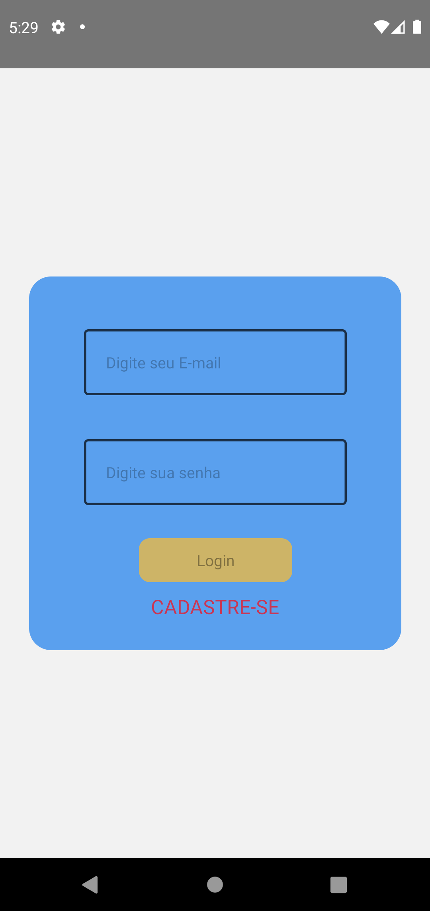
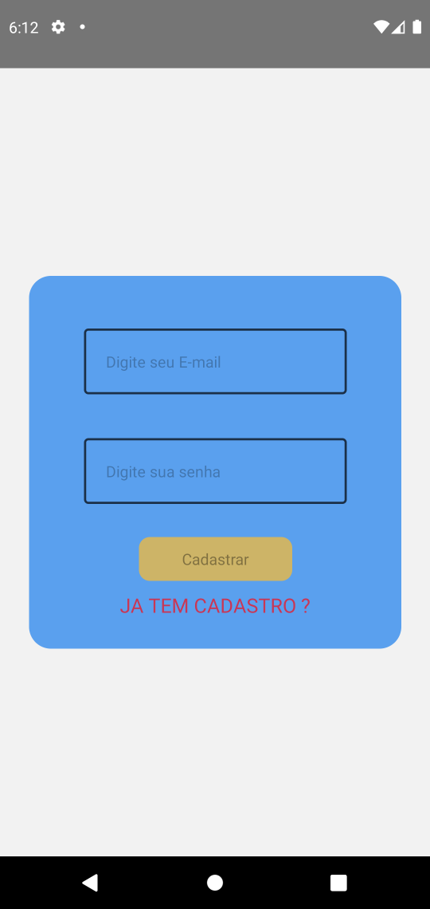
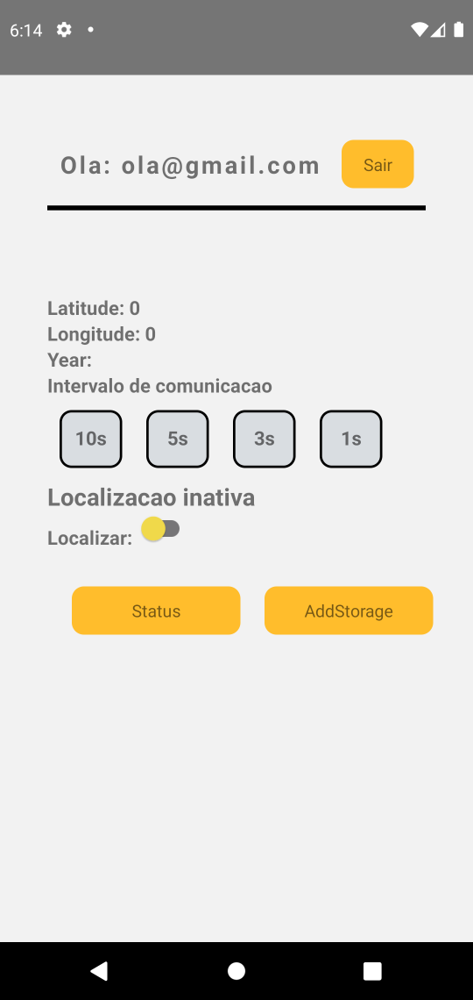
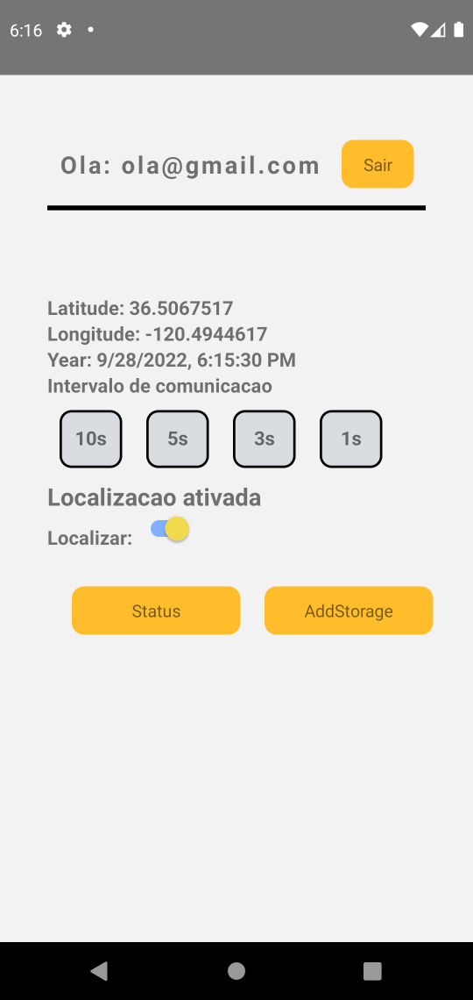

# contele_teste
Repositorio destinado ao teste em desenvolvimento mobile para a contele

## Sobre o APP

O App foi um grande desafio e tive algumas dificuldades em terminá-lo, mas, com empenho, dedicação e claro muita amor e forca de vontade.

Todas as especificações foram atendidas, não consegui fazer o mesmo funcionar em ios pois nao tenho dispositivo e não encontrei nenhum emulador de dispositivos da apple para linux, mas para android o app esta totalmente funcional.

## Algumas Tecnologias usadas

* React Native
* Hooks
* Geolocalização (obter localização)
* Sincronização 
* Offline
* Clean Code
* ESLint
* Axios
* Firebase
* Asynctorage

## Imagens e Uso

O App e bem simples de usar, tendo uma tela de login e uma de cadastro, uma para setar a localização atual e enviala para uma Screen de status, e a nossa Screen de Status que guarda as localizaçoes em um local storage asincrono.

Screen Login:

Screen Cadastro:

Screen Home:

Screen Empty Status:

Screen Home com informacoes:

Screen Cadastro com informacoes:

