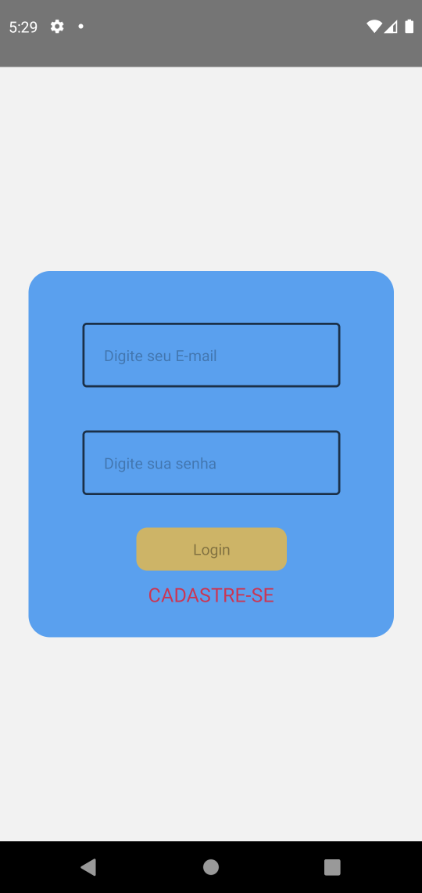

# contele_teste
Repositorio destinado ao teste em desenvolvimento mobile para a contele

## Sobre o APP

O App foi um grande desafio e tive algumas dificuldades em terminá-lo, mas, com empenho, dedicação e claro muita amor e forca de vontade.

Todas as especificações foram atendidas, não consegui fazer o mesmo funcionar em ios pois nao tenho dispositivo e não encontrei nenhum emulador de dispositivos da apple para linux, mas para android o app esta totalmente funcional.

## Algumas Tecnologias usadas

* React Native
* Hooks
* Geolocalização (obter localização)
* Sincronização 
* Offline
* Clean Code
* ESLint
* Axios
* Firebase
* Asynctorage

## Uso

Antes de começar a usar o aplicativo vamos instalar algumas dependências necessarias, depois de fazer o clone do repositorio, vamos abrir um terminal e acessar a pasta do projeto com o comando cd /react-native/conteletest.

Feito isso vamos usar o comando npm install para instalar as dependências do app.

```
npm install
```

Depois de istalar as dependências usaremos o comando npx react-native start para iniciar o servidor do nosso app.

```
npx react-native start
```

Abrimos outra aba o terminal e digitamos o comando npx react-native run-android para instalar o nosso app no emulador ou no smartphone via usb.

```
npx react-native run-android
```

Para fazer login ja temos um usuario teste e uma senha configurados.

User:
 
```
ola@gmail.com
```

Senha:
 
```
12345678
```

Feito o login temos a nossa tela inicial onde com um clique podemos definir o nosso intervalo de comunicação, ou deixá-lo por padrão em 10 segundos, e usando o toggle podemos iniciar a nossa localização.

Tambem temos dois botoes na nossa Home, um de status para visualizar os pontos salvos chamado Status e um de adicionar os pontos a ela de Status chamado AddStorage.

Na nossa tela de status, ficam guardados todos os nossos pontos adcionados em uma flatlist e quando quisermos enviar nossos ponos ao servidor, basta tocar no ponto que quisermos e ele sera removido do storage asincrono e enviado ao server.

Caso nao tenha conexão com a internet basta ir guardando os pontos no Local storage que depois voce pode envialos, quando tiver Conexão.

## Imagens

O App e bem simples de usar, tendo uma tela de login e uma de cadastro, uma para setar a localização atual e enviala para uma Screen de status, e a nossa Screen de Status que guarda as localizaçoes em um local storage asincrono.

## Screen Login:



## Screen Cadastro:


## Screen Home:


## Screen Empty Status:


## Screen Home com informacoes:


## Screen Cadastro com informacoes:

